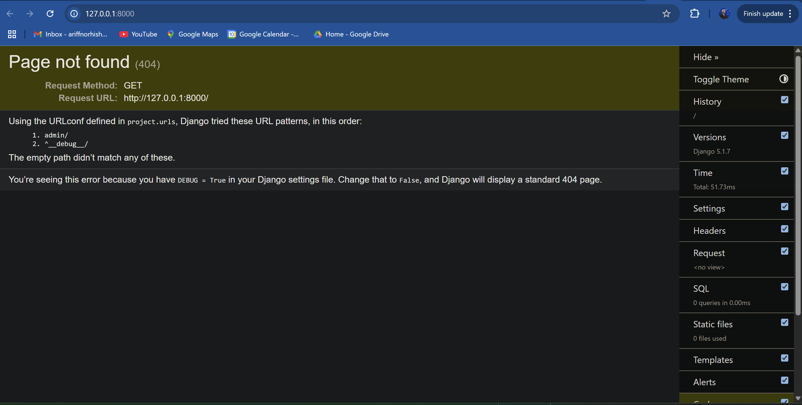

# Student Tracking Web Application Using Python Django

## 📌 Project Overview
**Project-I** is a Django-based web application designed to help internship supervisors efficiently manage and monitor student internship progress for their respective internship periods. The system replaces traditional spreadsheets with a scalable, user-friendly solution.

## 🚀 Features
- 🔍 **Student Database Management**: Add, update, and track students easily.
- 📅 **Internship Tracking**: Monitor student internship progress and status.
- 🏢 **Company Assignments**: Keep records of student placements at different companies.
- 📊 **Performance Reports**: Generate and view student performance summaries.
- 📜 **Automated Notifications**: Notify students and supervisors about important updates.

## 🛠️ Tech Stack
- **Backend**: Django, Python
- **Frontend**: HTML, CSS, JavaScript (optional React for future scalability)
- **Database**: PostgreSQL / SQLite (for development)
- **Version Control**: Git & GitHub

## 📂 Project Setup
### Prerequisites
Ensure you have the following installed:
- Python 3.10+
- Pipenv (for virtual environment management)
- PostgreSQL (if using a database other than SQLite)
- Git (for collaboration and version control)
- GitHub Account (for collaboration and version control)

### Installation
1. **Clone the Repository**
   ```bash
   git clone https://github.com/Fractylz/Project-I.git
   cd Project-I
   ```

2. **Set Up the Virtual Environment**
   ```bash
   pipenv install
   pipenv shell
   ```

3. **Apply Database Migrations**
   ```bash
   python manage.py migrate
   ```

4. **Create a Superuser** (for admin access)
   ```bash
   python manage.py createsuperuser
   ```

5. **Run the Development Server**
   ```bash
   python manage.py runserver
   ```
   Access the app at [http://127.0.0.1:8000](http://127.0.0.1:8000).

6. **Signs You've Succeeded**



## 📝 Usage
- **Admin Panel**: Navigate to `/admin/` to manage supervisors, students and internships.
- **Student Dashboard**: Students can log in and track their internship progress.
- **Supervisor Access**: Supervisors can update student performance records.

## 📖 Contributing
Contributions are welcome! Follow these steps:
1. Fork the repository.
2. Create a new branch (`git checkout -b feature-branch`).
3. Make your changes and commit them (`git commit -m 'Add feature'`).
4. Push to your fork (`git push origin feature-branch`).
5. Open a Pull Request.

## ⚠️ License
This project is licensed under the MIT License. See `LICENSE` for details.

## 📬 Contact
For any questions or feedback, reach out at [ariffnorhishambusiness@gmail.com](mailto:ariffnorhishambusiness@gmail.com).

